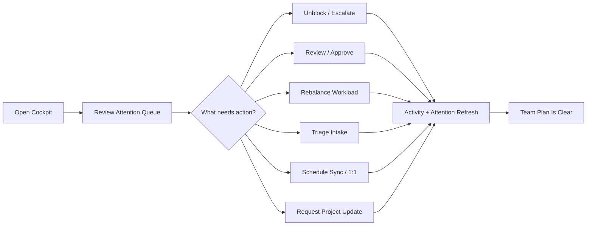

# Manager Operating System Implementation Plan

## Goal

Turn Taskara from a task tracker into a manager operating system.

The target user should be able to open Taskara and immediately answer:

- Who needs my attention?
- Who has too much work?
- Who has no clear plan?
- What needs review?
- What is blocked, stale, overdue, or unassigned?
- Who needs a sync or 1:1?
- Which new tasks should be assigned, and to whom?
- What changed since the last check-in?

This plan is intentionally flow-first. The implementation should make the daily management loops reliable before adding more reporting or AI surface area.

## Current System Summary

Taskara already has useful foundations:

- Workspaces, teams, members, projects, subprojects, tasks, task comments, labels, dependencies, attachments, and views.
- Task statuses: `BACKLOG`, `TODO`, `IN_PROGRESS`, `IN_REVIEW`, `BLOCKED`, `DONE`, `CANCELED`.
- Task priority, due date, weight, assignee, reporter, and activity logging.
- Local-first task sync using `WorkspaceSyncState`, `SyncEvent`, and `ClientMutation`.
- Inbox notifications with collapsed threads.
- Meetings, announcements, knowledge spaces/pages, Mattermost integration, Codex MCP tooling, and agent runs.
- A `HeartbeatView` that already shows today workload, overdue tasks, in-progress tasks, done today, and people with no in-progress task.

Initial gaps that drove this plan:

- Manager attention is not a first-class domain concept.
- Workload is currently mostly counts, not capacity, active load, review load, blocked age, or risk.
- Review work has no reviewer, request time, SLA, approval, or "waiting on" state.
- Triage is mixed into ordinary task filtering instead of being a decision flow.
- 1:1s and syncs exist as generic meetings, not as a recurring people-management loop.
- Agent work is useful but narrow and not deeply tied to a manager review/apply workflow.
- Admin visibility currently depends on team membership in several places, which can prevent managers from seeing all work.

The current branch has addressed most of these as backend/domain foundations. The remaining work is product completion: focused manager surfaces, local-first correctness across manager mutations, browser QA, and launch decisions.

## Current Branch Status

As of 2026-07-06, the current branch has already implemented most of the manager-operating-system foundation:

- Access Policy Module for widened admin/manager visibility.
- Work Health summary and Manager Cockpit route.
- Persistent Attention lifecycle with snooze, resolve, dismiss, sync events, and cadence/project-health signals.
- Review requests with reviewer ownership, decisions, notifications, activity, and sync events.
- Capacity and working agreements with assignment recommendations.
- Backlog triage actions, durable waiting/snooze state, and durable split into child backlog tasks.
- Check-ins, 1:1 series, generated agendas, meeting action items, carry-forward, and action-item-to-task conversion.
- Project health updates with Mattermost publish fallback.

Do not consider the work complete until these remaining finish gates pass:

1. Preserve every durable manager mutation across route changes, reconnects, workspace-data refreshes, rejected mutations, and sync-gap recovery.
2. Expand browser QA beyond the current manager smoke matrix for RTL Persian, empty workspace, long names/titles, large workspaces, limited members, admins with no teams, issue detail, inbox, meetings, and optional Mattermost failures.
3. Decide whether on-demand attention generation is enough for MVP or whether a scheduled worker is needed before launch.

Already completed in the current branch:

- Replaced the primary leaderboard-style UI with Team Health.
- Routed both `/team-health` and legacy `/leaderboard` to `TeamHealthView`.
- Changed sidebar and command-palette copy to `سلامت تیم‌ها`.
- Removed the old `LeaderboardView` component.
- Added exact status counts to Work Health so Team Health can show flow diagnostics instead of a done-count ranking.
- Added `apps/web/lib/workspace-data/*` selectors and event application for manager entities.
- Wired workspace-data into task sync, sidebar counts, command/search, issue detail, and focused member task lookup.
- Filtered manager sync events server-side so restricted attention, review, check-in, meeting, and project-health entities are omitted when access cannot be proven.
- Added route-level Fastify injection access tests for attention, reviews, assignment, triage, check-ins, 1:1s, meeting action items, project health updates, and sync bootstrap/pull.
- Added durable `/sync/push` mutations for attention snooze, resolve, and dismiss, with cockpit optimistic queue updates and pending-overlay tests.
- Added durable `/sync/push` mutations for check-ins, 1:1 creation, 1:1 agenda item creation, meeting action item create/update/complete/cancel/carry-forward, and action-item-to-task conversion; cockpit 1:1/action-item writes now use the durable path.
- Added durable `/sync/push` mutation use for project health creation from the Projects view; retryable failures keep the mutation pending and show queued Persian copy. Mattermost publishing remains a direct optional external call because the saved health update is the source of truth.
- Added workspace refresh dispatch after pending sync-mutation flushes, and wired Projects/Cockpit to refresh from relevant workspace events so queued manager mutations become visible after reconnect without a manual page reload.
- Added tested pending overlays for freshly fetched Cockpit attention and open meeting action items, so queued snooze/resolve/dismiss/complete/convert/update decisions do not reappear after route changes while still pending.
- Added tested pending overlay for freshly fetched Projects data, so queued project-health updates render as the latest project update while waiting for reconnect.
- Added tested pending overlays for Cockpit 1:1 series and agenda item creation; queued 1:1 rows render as disabled "در صف" instead of opening a nonexistent server agenda, and queued agenda items remove matching generated suggestions after refetch.
- Added tested pending overlay for meeting-action-item carry-forward into 1:1 agendas; queued carry-forward items are synthesized from fetched open action items, de-duplicate against existing agenda sources, and remove matching generated agenda suggestions.
- Wired Team Health to relevant workspace refresh events so the diagnostic surface follows task/project/attention/sync changes without relying only on initial page load.
- Added a focused `/queues` Decision Queues surface for review, triage/backlog, unassigned ownership, blocker/stale follow-up, and people follow-up. It uses the backend Work Health summary as the source of truth, links each task row to the existing resolving issue workflow, and is wired into primary navigation and the command palette.
- Added a focused `/reviews` My Reviews surface for reviewer-owned decisions. It loads `GET /reviews/mine`, shows SLA/requester/task context, links back to the task workflow, and applies approve, request-changes, and cancel through the backend review decision routes without duplicating review business rules in the frontend.
- Wired `/reviews` into route metadata, primary sidebar navigation, command palette search/actions, page-owned scrolling, and Persian RTL copy. The sidebar badge uses workspace-data review counts when sync bootstrap is ready.
- Added a focused `/people` People Workload surface for manager drill-down from Cockpit, Team Health, and Decision Queues. It consumes backend Work Health summary data, overlays missing check-ins and active 1:1 series, shows active/today weight, review/blocker/overdue/stale load, current tasks, and gives managers direct actions for assigned task creation, sync scheduling, 1:1 creation/opening, and check-in request copy.
- Extended the global task composer so manager surfaces can safely open task creation with a prefilled assignee after validating the prefill against loaded workspace users/projects/status/priority values.
- Added a focused `/capacity` Capacity and Working Agreements surface for admins/managers. It consumes the backend `/capacity/users`, `/capacity/agreements`, and `/teams` APIs, shows backend-provided safe defaults when a user has no explicit capacity row, edits per-user daily/weekly capacity and active state, and edits workspace/team WIP, review SLA, blocked SLA, and stale thresholds without recomputing Work Health rules in the frontend.
- Wired `/capacity` into route metadata, page-owned scrolling, the command palette, secondary sidebar navigation, and People Workload discovery so overloaded-person follow-up has a direct path to capacity tuning.
- Added inline Decision Queues triage controls for backlog intake. The focused backlog panel now exposes accept, request-info, duplicate, split, snooze, and decline actions backed by the backend triage routes; accept collects the missing priority and explicit unassigned reason before moving unqualified work out of `BACKLOG`, and split creates child backlog tasks while canceling the original intake item.
- Added durable triage state for backlog intake. `TaskTriageState` records waiting-for-info and snoozed decisions, `POST /triage/tasks/:idOrKey/snooze` validates future snooze windows and reasons, request-info now persists a waiting state, and Work Health filters waiting/future-snoozed backlog items out of the actionable triage queue. Existing task comments remain the audit/notification path.
- Added Playwright browser QA for manager surfaces under `apps/web/e2e/manager-os.spec.ts`, with mocked authenticated API fixtures for long Persian text, review SLA, reviewer decisions, backlog intake, unassigned work, blockers, stale work, overloaded people, missing check-ins, due 1:1s, project risk, and People Workload assignment. The suite covers `/queues`, `/reviews`, `/people`, `/cockpit`, `/team-health`, and `/projects` on desktop and mobile Chromium with no horizontal-overflow checks.
- Expanded manager browser QA to cover issue detail, inbox, meetings, and optional project-health Mattermost fallback. The issue detail check caught and fixed a real desktop overflow in the review sidebar by constraining the sidebar, review card, status badge, and date metadata rows.
- Added explicit Persian conflict/rejection copy for durable sync-push manager mutations. Direct sync calls now throw action-specific `TaskSyncMutationError` messages, background flushes emit typed rejection events, and the workspace sync provider shows user-facing Persian toasts without exposing raw mutation names or backend English messages.
- Latest verification passed on 2026-07-05: `git diff --check`, `bun test apps/api/src/routes/manager-access.test.ts`, `bun run test:api`, API/web typecheck, API/web lint, `bun test apps/web/lib/workspace-data/*.test.ts`, and `bun run --filter @taskara/web build` with the existing Vite large-chunk warning.
- Focused pending-overlay, Projects, Cockpit 1:1/action-item, and Team Health refresh verification passed on 2026-07-06: `bun test apps/web/lib/workspace-data/*.test.ts`, `bun run --filter @taskara/web typecheck`, `bun run --filter @taskara/web lint`, `bun run --filter @taskara/web build`, and `git diff --check`.
- Focused Decision Queues frontend verification passed on 2026-07-06: `bun run --filter @taskara/web typecheck`, `bun run --filter @taskara/web lint`, `bun run --filter @taskara/web build`, `bun test apps/web/lib/workspace-data/*.test.ts`, and `git diff --check`.
- Initial browser QA verification passed on 2026-07-06: `bun run --filter @taskara/web test:e2e:manager` after installing Playwright Chromium, plus `bun run --filter @taskara/web typecheck`, `bun run --filter @taskara/web lint`, `bun run --filter @taskara/web build`, `bun test apps/web/lib/workspace-data/*.test.ts`, and `git diff --check`.
- Focused My Reviews verification passed on 2026-07-06: `git diff --check`, `bun run --filter @taskara/web typecheck`, `bun run --filter @taskara/web lint`, `bun run --filter @taskara/web build`, `bun test apps/web/lib/workspace-data/*.test.ts`, and `bun run --filter @taskara/web test:e2e:manager` with 6 desktop/mobile manager browser checks passing.
- Full API regression verification passed on 2026-07-06 after final Reviews wiring: `bun run test:api` with 94 API/service tests passing, plus the focused `bun test apps/api/src/routes/manager-access.test.ts` suite with 12 route-level access checks passing.
- Focused People Workload verification passed on 2026-07-06: `git diff --check`, `bun run --filter @taskara/web typecheck`, `bun run --filter @taskara/web lint`, `bun run --filter @taskara/web build`, `bun test apps/web/lib/workspace-data/*.test.ts`, and `bun run --filter @taskara/web test:e2e:manager` with 8 desktop/mobile manager browser checks passing.
- Focused Capacity Settings verification passed on 2026-07-06: `bun run --filter @taskara/web typecheck`, `bun run --filter @taskara/web lint`, and `bun run --filter @taskara/web test:e2e:manager` with 10 desktop/mobile manager browser checks passing, including `/capacity` user-capacity edit, working-agreement edit, safe-default badge, People Workload capacity link, and no horizontal overflow.
- Full verification after Capacity Settings wiring passed on 2026-07-06: `git diff --check`, `bun run typecheck`, `bun run lint`, `bun run --filter @taskara/web build`, `bun test apps/web/lib/workspace-data/*.test.ts`, `bun run --filter @taskara/web test:e2e:manager`, `bun run test:api`, and `bun test apps/api/src/routes/manager-access.test.ts`.
- Focused inline triage verification passed on 2026-07-06: `git diff --check`, `bun run typecheck`, `bun run lint`, `bun run --filter @taskara/web build`, `bun test apps/web/lib/workspace-data/*.test.ts`, `bun run --filter @taskara/web test:e2e:manager` with 12 desktop/mobile manager browser checks, and `bun run test:api` with 94 API/service tests passing.
- Durable triage state verification passed on 2026-07-06: `bun prisma db push --schema packages/db/prisma/schema.prisma` applied the new local table after `migrate deploy` was blocked by an existing unrelated failed local migration record (`20260429100000_user_phone_sms`), then `git diff --check`, `bun run typecheck`, `bun run lint`, `bun run --filter @taskara/web build`, `bun test apps/web/lib/workspace-data/*.test.ts`, `bun run --filter @taskara/web test:e2e:manager` with 14 desktop/mobile manager browser checks, and `bun run test:api` with 96 API/service tests passing.
- Durable split triage verification passed on 2026-07-06: `bun run --filter @taskara/api typecheck`, `bun run --filter @taskara/shared typecheck`, `bun test apps/api/src/services/triage.test.ts apps/api/src/routes/manager-access.test.ts` with 16 tests passing, `bun run --filter @taskara/web typecheck`, `bun run --filter @taskara/web lint`, `bun run --filter @taskara/web test:e2e:manager` with 16 desktop/mobile manager browser checks, `git diff --check`, `bun run typecheck`, `bun run lint`, `bun run --filter @taskara/web build`, `bun test apps/web/lib/workspace-data/*.test.ts` with 16 tests passing, and `bun run test:api` with 97 API/service tests passing. The web build still emits the existing Vite large-chunk warning.
- Expanded browser QA verification passed on 2026-07-06: `bun run --filter @taskara/web typecheck`, `bun run --filter @taskara/web lint`, and `bun run --filter @taskara/web test:e2e:manager` with 19 checks passing and 1 expected mobile skip for the desktop-only Mattermost publish action.
- Full verification after expanded browser QA passed on 2026-07-06: `git diff --check`, `bun run typecheck`, `bun run lint`, `bun run --filter @taskara/web build`, `bun test apps/web/lib/workspace-data/*.test.ts` with 16 tests passing, `bun run test:api` with 97 API/service tests passing, and `bun run --filter @taskara/web test:e2e:manager` with 19 checks passing and 1 expected mobile skip. The web build still emits the existing Vite large-chunk warning.
- Sync rejection-copy verification passed on 2026-07-06: `bun run --filter @taskara/web typecheck`, `bun run --filter @taskara/web lint`, `bun test apps/web/lib/task-sync.test.ts` with 3 tests passing, `bun run --filter @taskara/web test:e2e:manager` with 20 checks passing and 2 expected mobile skips, `git diff --check`, `bun run typecheck`, `bun run lint`, `bun run --filter @taskara/web build`, `bun test apps/web/lib/task-sync.test.ts apps/web/lib/workspace-data/*.test.ts` with 19 tests passing, and `bun run test:api` with 97 API/service tests passing. The web build still emits the existing Vite large-chunk warning.
- Sync-gap and manager pending-overlay hardening passed on 2026-07-06: `meeting_action_item.create` now replays as a pending open action item over fresh open-action-item fetches, and pure task bootstrap reconciliation tests prove pending task create/update/delete state survives reset-required re-bootstrap.
- Expanded browser QA now covers default manager flows, empty workspace, limited member scope, admin with no team membership, project lead outside team, long Persian copy, large capped workspaces, issue detail, inbox, meetings, and Mattermost missing-binding/missing-config fallbacks. Latest manager browser verification passed on 2026-07-06 with `bun run --filter @taskara/web test:e2e:manager`: 31 checks passed and 3 expected mobile skips for desktop-only project health actions.
- Launch decision on 2026-07-06: on-demand attention generation is enough for MVP. `GET /attention` generates by default, Cockpit calls `/attention?limit=24` on load, Work Health covers stale blockers, overdue/review/due-soon/unassigned/person/project signals, and the Attention Module adds missing check-ins, due 1:1s, and stale meeting action items. A scheduled worker is deferred until Taskara promises background/push/inbox freshness before a manager opens Cockpit.
- Final verification after the finish-gate pass completed on 2026-07-06: `git diff --check`, `bun run typecheck`, `bun run lint`, `bun run --filter @taskara/web build`, `bun test apps/web/lib/task-sync.test.ts apps/web/lib/workspace-data/*.test.ts`, `bun run test:api`, and `bun run --filter @taskara/web test:e2e:manager` all passed. The web build still emits the existing Vite large-chunk warning.

## MVP Completion Roadmap

This is the current implementation plan for finishing the manager operating system from the 2026-07-06 worktree state. The foundation is already in place; the remaining work is to make every manager flow durable, visible, permission-safe, and browser-proven.

Do not start more reporting or AI features until these phases are complete.

### Phase 1: Local-First Workspace Data Hardening

Goal:

Make route changes, reconnects, refreshes, and sync-gap recovery preserve manager decisions the same way task edits are preserved.

Implementation:

1. Treat `apps/web/lib/workspace-data/*` as the frontend Module for already-synced manager entities and selector output.
2. Keep backend Modules as the source of truth for health, attention, review SLA, overload, stale, and access rules. Frontend selectors may select and format; they must not recompute business rules.
3. Move consumers only where it removes duplicate state or stale counts:
   - cockpit attention/review/1:1/action-item/project-health state;
   - sidebar attention/review/action-item counts;
   - inbox summary/counts;
   - task list and issue detail review/assignment/triage badges;
   - Team Health refresh triggers and diagnostic counts.
4. Build a single pending-overlay registry in `workspace-data/pending.ts` for every durable manager mutation:
   - `attention.resolve`, `attention.snooze`, `attention.dismiss`;
   - `check_in.create`;
   - `one_on_one.create`;
   - `one_on_one_agenda_item.create`;
   - `meeting_action_item.create`, `meeting_action_item.update`, `meeting_action_item.complete`, `meeting_action_item.cancel`, `meeting_action_item.carry_forward`, `meeting_action_item.create_task`;
   - `project_health_update.create`;
   - future review and triage mutations if they move to `/sync/push`.
5. Replay pending overlays over every fresh fetch, bootstrap, route re-entry, reconnect flush, and reset-required re-bootstrap.
6. Add conflict and rejected-mutation copy for manager actions where the server refuses the queued decision.

Acceptance criteria:

- A queued attention snooze/resolve/dismiss never reappears as open after a route change while still pending.
- A queued project health update remains visible as the latest update even after refresh or reconnect.
- A queued 1:1 series or agenda item remains visible without opening a synthetic server ID.
- A reset-required sync pull re-bootstraps without dropping pending task or manager mutations.
- Sidebar, cockpit, inbox, issue detail, and command/search agree on counts after sync events.

Verification:

- Extend `apps/web/lib/workspace-data/pending.test.ts` for every durable manager mutation.
- Extend `apps/web/lib/workspace-data/sync-events.test.ts` for every manager sync entity type.
- Add selector tests for sidebar, cockpit, inbox, issue detail, task list, and Team Health outputs as consumers migrate.

### Phase 2: Missing Manager Surfaces

Goal:

Make the user goals reachable without hidden workflows. The Cockpit can remain the first screen, but each major queue needs a focused surface or a focused panel.

Implementation:

1. Reviews:
   - keep the focused Decision Queues review panel as the manager-wide queue;
   - use `/reviews` as the focused "My Reviews" route for reviewer-owned decisions;
   - show requester, requested time, SLA state, task status/priority/project, and task link;
   - expose approve, request changes, and cancel from the focused surface;
   - add reassign only after the focused surface can present eligible reviewers and access constraints without duplicating backend rules.
2. Triage:
   - keep the focused Decision Queues backlog panel as the manager-wide intake queue;
   - use the inline accept, request-info, duplicate, split, snooze, and decline controls in Decision Queues for the current MVP-backed actions;
   - keep accept guarded by priority plus assignee or explicit leave-unassigned reason;
   - keep split backend-owned through `POST /triage/tasks/:idOrKey/split`, which creates child backlog tasks, cancels the original intake item, records a triage comment, emits sync events, and applies the same access policy as other triage decisions;
   - every item must end in accept, assign, request info, duplicate, decline, split, snooze, or explicit leave-unassigned reason.
3. People workload:
   - keep the focused Decision Queues people follow-up panel as the daily risk queue;
   - use `/people` as the deeper people workload drill-down from Cockpit, Team Health, and Decision Queues;
   - show active weight, today weight, review load, blocked load, overdue load, capacity, and current tasks;
   - include "assign task", "schedule sync", "open 1:1", and "request check-in" actions;
   - add first-class request-check-in delivery only after the backend has a durable notification/action model for it; current MVP copies a check-in request message rather than pretending a persisted request exists.
4. Attention:
   - keep Cockpit as the primary attention queue;
   - add a dedicated attention list only if the queue becomes too dense for one screen.
5. Capacity/settings:
   - keep `/capacity` as the focused admin/manager editing surface for user capacity and working agreements;
   - keep safe defaults visible when capacity is missing;
   - keep backend Work Health and Assignment Modules as the source of truth for overload, WIP, SLA, and stale calculations.

Acceptance criteria:

- A manager can answer "who needs my attention?", "who needs review?", "who is overloaded?", and "who needs a sync?" without using raw task filters.
- Every queue row has reason, source timestamp, owner/waiting-on state, and a resolving action.
- Empty states are operational and link to setup or capture actions.

### Phase 3: Browser QA Harness

Goal:

Move from unit/API confidence to product confidence in the actual RTL Persian app.

Implementation:

1. Add Playwright as the browser QA harness for `@taskara/web`.
2. Keep the current mocked authenticated manager fixtures for fast deterministic coverage, and add database-backed seed support when route-level browser tests need real API behavior:
   - empty workspace;
   - owner/admin with no team membership;
   - regular member with limited visibility;
   - project lead outside the team;
   - long Persian names, emails, task titles, and project names;
   - large workspace with 500+ active tasks and 100+ attention candidates;
   - overdue, blocked, stale, in-review, unassigned, backlog, overloaded, idle, missing-check-in, due-1:1, stale-action-item, and stale-project examples;
   - Mattermost unbound/missing-config/failure cases.
3. Add authenticated browser fixtures instead of clicking through signup for every spec.
4. Cover these routes first:
   - `/queues`;
   - `/reviews`;
   - `/people`;
   - `/cockpit`;
   - `/team-health`;
   - `/projects`;
   - `/issue/:taskKey`;
   - `/inbox`;
   - `/meetings`;
   - focused review/triage/people routes when added.
5. Add responsive checks at desktop and mobile widths.
6. Add no-overlap/no-horizontal-overflow checks for the main manager surfaces.

Acceptance criteria:

- RTL layout has no incoherent overlap, clipped button labels, or page-level horizontal overflow.
- Long Persian copy wraps or truncates deliberately.
- Empty workspaces, limited members, and admins with no teams render useful states.
- Large workspaces remain responsive and show truncation/limit copy when backend caps results.
- Optional Mattermost failures keep the saved project update and show fallback copy.

Required commands after harness exists:

```bash
bun run --filter @taskara/web test:e2e
bun run --filter @taskara/web test:e2e:manager
```

### Phase 4: Launch Decisions

Resolve these before calling the manager operating system launch-ready:

1. Attention refresh:
   - MVP decision: keep on-demand generation before launch.
   - Evidence: `GET /attention` generates unless `generate=false`; Cockpit calls `/attention?limit=24`; Work Health supplies stale blockers, overdue reviews, project risk, and project update reminders; the Attention Module adds missing check-ins, due 1:1s, and stale meeting action items.
   - Add a scheduled worker when Taskara needs background notifications, inbox freshness, or SLA guarantees before a manager opens Cockpit.
2. Manager role model:
   - keep `OWNER`/`ADMIN` as manager-wide access for MVP;
   - add a separate `MANAGER` role only when non-admin managers and direct-report relationships are needed.
3. Check-in privacy:
   - decide whether admins see all check-ins or only managers/direct participants once direct-manager relationships exist.
4. Status history:
   - defer cycle-time charts until first-class status transition snapshots exist;
   - backfill from activity logs and use fixed-clock tests before using history for SLA or chart decisions.
5. Mattermost intake:
   - decide whether all quick capture defaults to `BACKLOG` or whether channel/project rules can safely place work into execution.

### Phase 5: Final Release Gate

A flow is complete only when it passes this full chain:

1. Backend rule exists and is covered with fixed-clock or access tests.
2. Signal appears in Cockpit or its focused queue with reason, timestamp, severity, and owner/waiting-on state.
3. Resolving action exists and writes durable state.
4. Activity log, notification, and sync event are written where relevant.
5. Pending local mutation survives route changes, refreshes, reconnects, and sync-gap recovery.
6. Browser QA passes for owner/admin, limited member, project lead, empty workspace, long Persian text, large workspace, mobile, desktop, and optional integration failure.
7. The flow does not expose restricted details through routes, sync events, counts, search, reports, inbox, attention payloads, notifications, or agent output.

Do not mark the manager operating system done unless all seven checks pass for every flow in the Perfect Flow Contract.

## Industry Reference Points

Use these as product checks while implementing:

- Linear: triage inboxes, project health updates, SLAs, and focused personal issue ordering.
  References: [Linear Triage](https://linear.app/docs/triage), [Linear project updates](https://linear.app/docs/initiative-and-project-updates), [Linear My Issues](https://linear.app/docs/my-issues), [Linear SLAs](https://linear.app/docs/sla).
- Asana and ClickUp: workload views with capacity, effort, time windows, unassigned/unscheduled work, and rebalancing actions.
  References: [Asana Workload with effort and capacity](https://help.asana.com/s/article/portfolio-workload-and-universal-workload), [ClickUp Workload view](https://help.clickup.com/hc/en-us/articles/6310449699735-Use-Workload-view), [ClickUp capacity limits](https://help.clickup.com/hc/en-us/articles/30799771936279-Set-capacity-limits-in-Workload-view).
- Jira and Atlassian: WIP limits, cumulative flow, blocker visibility, bottleneck detection, and sustainable pace.
  References: [Atlassian WIP limits](https://www.atlassian.com/agile/kanban/wip-limits), [Jira cumulative flow diagram](https://support.atlassian.com/jira-software-cloud/docs/view-and-understand-the-cumulative-flow-diagram/).
- Range and Lattice: async check-ins, sync cadence, shared 1:1 agendas, and action items that carry forward until completed.
  References: [Range check-ins](https://www.range.co/product/check-ins), [Lattice 1:1 action items](https://help.lattice.com/hc/en-us/articles/360060026934-Add-and-Manage-1-1-Action-Items).
- SPACE and DORA: use multiple dimensions and system-level flow metrics to improve the system, not to rank individuals with one score.
  References: [SPACE paper](https://queue.acm.org/detail.cfm?id=3454124), [DORA metrics](https://dora.dev/guides/dora-metrics/).

### Research Synthesis

The industry pattern is consistent: managers do not need another filtered task list; they need a small number of trusted decision queues.

- Intake should behave like Linear triage: new work waits in a decision queue, rules can pre-fill metadata, and every item is accepted, routed, clarified, split, declined, duplicated, or snoozed.
- Workload should behave like Asana/ClickUp workload planning: use effort, capacity, due windows, and rebalancing actions. Count-only workload is a weak signal and should never be the primary basis for assignment.
- Team health should borrow from Kanban, Jira, DORA, and SPACE: show WIP, bottlenecks, blocked age, review age, flow, reliability, and qualitative context. Avoid one-score personal productivity or done-count leaderboards.
- Sync and 1:1 flows should behave like Range/Lattice patterns: lightweight check-ins create shared context, recurring 1:1s keep a carried-forward agenda, and action items remain visible until resolved.
- Agent features should follow the repo's existing proposal/apply pattern: agents may summarize, suggest, draft, and batch-propose, but a human applies changes.

## Product Principles

1. The first screen should be a cockpit, not a list.
   The manager should see ordered attention items, person workload, review queue, blockers, overdue work, and suggested actions.

2. Attention is a lifecycle.
   Attention items can be open, snoozed, assigned, resolved, or dismissed with a reason. A notification is only an event; an attention item is work for a manager.

3. Capacity beats raw counts.
   Workload should use active weight, review weight, WIP, due-date pressure, blocked age, and explicit capacity. Raw assigned task count should be secondary.

4. Review is work.
   Review requests need ownership, requested time, SLA, approval state, and reminders.

5. Triage is a decision flow.
   Backlog and incoming work need accept, assign, request info, duplicate, decline, snooze, and split actions.

6. Agents propose, humans apply.
   Bulk changes, task creation from long text, assignment suggestions, and attention cleanup should stay proposal-based until a user applies them.

7. Metrics should not become a leaderboard.
   Replace individual ranking as a primary view with team health, flow, and workload diagnostics.

8. Every flow needs a source of truth.
   Do not duplicate attention, health, and workload rules across pages. Put them behind deep Modules and test those Modules through their Interfaces.

## Manager Operating Loop

The product should be optimized around this loop:



The important product constraint is that each branch ends in a persisted state change, an audit trail, or a deliberate snooze/dismissal. If a cockpit signal cannot be acted on, it should not appear as an attention item.

## Cross-Cutting Invariants

These invariants must hold across every slice:

- Access is resolved once through the Access Policy Module, then reused by task, project, team, sync, work-health, attention, review, meeting, knowledge, agent, and report routes.
- Backend Modules own business rules. Frontend code can sort, format, and link, but should not redefine overload, stale, blocked, review-SLA, or attention-generation rules.
- Every manager-facing signal includes: entity, reason, severity, source timestamp, resolving action, and access-safe link.
- Every state-changing manager action writes activity logs and, when relevant, sync events and notifications.
- Time-based rules use explicit timestamps: due date, review requested time, status-entered time, snooze-until time, check-in due time, project-update due time.
- No workflow silently hides work. Dismiss, snooze, decline, duplicate, and cancel actions require enough reason/context to reconstruct the decision later.
- AI never changes task ownership, priority, due date, review status, attention state, or meeting action items without an explicit human apply step.
- Metrics are diagnostic, not punitive. Team health may show bottlenecks and workload risk; it must not become a primary individual ranking surface.

## Perfect Flow Contract

Every manager workflow must satisfy this contract before it is marked done:

| Flow | Source of truth | Required persisted outcome | Must never happen |
| --- | --- | --- | --- |
| Manager morning review | `AttentionItem` + Work Health | snooze, resolve, dismiss, task/review/project/meeting action, or new comment/activity | decorative signal with no resolving action |
| Assign new task | Assignment Module + capacity/working agreements | assignee change, notification, activity, sync event, or explicit leave-unassigned reason | silent auto-assignment or unauthorized candidate |
| Review request | `TaskReviewRequest` | approval, changes requested, cancel, or reviewer reassignment | task status and review status contradict without cleanup |
| Triage intake | Triage Module over `BACKLOG` | accept, request info, duplicate, decline, split, snooze, or assignment decision | unqualified intake appears as executable work |
| 1:1 / sync | Check-in and 1:1 Modules | agenda item, meeting action item, linked task, completed action, or scheduled next sync | private notes or restricted attention leak to unauthorized users |
| Project health | `ProjectHealthUpdate` | health update, next update due date, Mattermost publish result, or attention item | at-risk/off-track project has no owner-facing next action |
| Team health | Work Health + future trend snapshots | bottleneck/action recommendation, not personal ranking | done-count leaderboard as the primary team view |
| Workspace data | Workspace Data Module selectors | local cache update, sync event application, or preserved pending mutation | route change clears useful state or drops unsynced work |

## Core Domain Additions

### Attention Item

Represents a manager-actionable signal.

Examples:

- Task is overdue.
- Task is blocked for too long.
- Task is in review past SLA.
- Person is overloaded.
- Person has no active work.
- Person has no today plan.
- Task is unassigned but due soon.
- Backlog item has no owner or priority.
- Project is at risk and has no recent update.
- 1:1 is due or has unresolved action items.

Initial fields:

```prisma
enum AttentionItemStatus {
  OPEN
  SNOOZED
  RESOLVED
  DISMISSED
}

enum AttentionItemSeverity {
  LOW
  MEDIUM
  HIGH
  URGENT
}

model AttentionItem {
  id                String              @id @default(uuid()) @db.Uuid
  workspaceId       String              @db.Uuid
  assigneeId        String?             @db.Uuid
  managerId         String?             @db.Uuid
  entityType        String
  entityId          String
  reason            String
  severity          AttentionItemSeverity
  status            AttentionItemStatus @default(OPEN)
  firstSeenAt       DateTime            @default(now())
  lastSeenAt        DateTime            @default(now())
  snoozedUntil      DateTime?
  resolvedAt        DateTime?
  dismissedAt       DateTime?
  dismissalReason   String?
  payload           Json
  createdAt         DateTime            @default(now())
  updatedAt         DateTime            @updatedAt

  @@unique([workspaceId, entityType, entityId, reason])
  @@index([workspaceId, status, severity, lastSeenAt])
  @@index([workspaceId, assigneeId, status])
  @@index([workspaceId, managerId, status])
}
```

Do not over-normalize in the first slice. Keep `payload` for explainability and UI copy, then deepen later if a pattern stabilizes.

### Work Health

Derived facts for people, tasks, teams, and projects.

Examples:

- active task count;
- active weight;
- today weight;
- review weight;
- blocked count;
- blocked max age;
- overdue count;
- stale task count;
- no active work;
- no recent completion;
- WIP over team limit;
- review queue over limit.

This can start as computed data. Persist snapshots only after the manager cockpit needs historical trend lines.

### Review Request

Represents review work, not just a task status.

Initial fields:

```prisma
enum TaskReviewStatus {
  REQUESTED
  CHANGES_REQUESTED
  APPROVED
  CANCELED
}

model TaskReviewRequest {
  id             String           @id @default(uuid()) @db.Uuid
  workspaceId    String           @db.Uuid
  taskId         String           @db.Uuid
  requesterId    String?          @db.Uuid
  reviewerId     String           @db.Uuid
  status         TaskReviewStatus @default(REQUESTED)
  requestedAt    DateTime         @default(now())
  respondedAt    DateTime?
  dueAt          DateTime?
  comment        String?
  createdAt      DateTime         @default(now())
  updatedAt      DateTime         @updatedAt

  @@index([workspaceId, reviewerId, status, dueAt])
  @@index([workspaceId, taskId, status])
}
```

Keep `Task.status = IN_REVIEW`; the review request explains who is reviewing and how long it has been waiting.

### Capacity and Working Agreements

Initial fields:

```prisma
model UserCapacity {
  id               String   @id @default(uuid()) @db.Uuid
  workspaceId      String   @db.Uuid
  userId           String   @db.Uuid
  dailyWeightLimit Float    @default(8)
  weeklyWeightLimit Float?
  active           Boolean  @default(true)
  note             String?
  updatedAt        DateTime @updatedAt

  @@unique([workspaceId, userId])
}

model TeamWorkingAgreement {
  id                String   @id @default(uuid()) @db.Uuid
  workspaceId       String   @db.Uuid
  teamId            String?  @db.Uuid
  scopeKey          String
  activeWipLimit    Int?
  reviewWipLimit    Int?
  reviewSlaHours    Int     @default(24)
  blockedSlaHours   Int     @default(24)
  staleAfterHours   Int     @default(72)
  updatedAt         DateTime @updatedAt

  @@unique([workspaceId, scopeKey])
  @@index([workspaceId, teamId])
}
```

Workspace-level agreement uses `teamId = null` and `scopeKey = "workspace"`. Team-level agreement uses `scopeKey = "team:<teamId>"`. Do not rely on a unique index over nullable `teamId`; PostgreSQL allows multiple null values.

### Check-in and 1:1 Cadence

Add after the cockpit and review flow are stable.

Concepts:

- `CheckInPrompt`
- `CheckInResponse`
- `MeetingSeries`
- `OneOnOneAgendaItem`
- `MeetingActionItem`

Keep action items linked to tasks when they become execution work.

## Architecture Plan

### Module 1: Access Policy

Files:

- `apps/api/src/services/team-access.ts`
- task, project, sync, meeting, knowledge routes

Problem:

Access filtering is repeated and shallow. Admins and managers can lose visibility if they are not in every team.

Implementation:

- Replace `listAccessibleTeamIds()` with a deeper access policy Module.
- Encode roles explicitly:
  - `OWNER` and `ADMIN`: workspace visibility by default.
  - team `OWNER`/`ADMIN`: team visibility.
  - project `LEAD`: project visibility.
  - `MEMBER`: assigned/team/project visibility.
  - `GUEST`: explicit project/task visibility only, if supported.
- Return both scope and predicates:
  - `workspaceWide: boolean`
  - `teamIds: string[]`
  - `projectIds: string[]`
  - helper methods for task/project/team where clauses.

Acceptance criteria:

- Workspace admin sees all teams, projects, tasks, users, views, and attention items.
- A member sees only allowed teams/projects plus unteamed public work if that remains intended.
- Team routes, project routes, sync bootstrap/pull, leaderboard replacement, and cockpit all use the same policy.
- Existing member restrictions remain enforced.

Tests:

- Add route or service tests for admin full visibility.
- Add tests for member visibility.
- Add tests for project lead visibility.
- Add regression tests for `/sync/bootstrap`, `/projects`, `/tasks`, and attention endpoints.

### Module 2: Work Health

Files:

- new `apps/api/src/services/work-health.ts`
- new `apps/api/src/routes/work-health.ts`
- `apps/api/src/routes/tasks.ts`
- `apps/web/components/taskara/heartbeat-view.tsx`
- new manager cockpit view

Problem:

Heartbeat and leaderboard compute signals locally or narrowly. There is no single Interface for "who needs attention".

Implementation:

- Add a Work Health Module with pure functions for:
  - `taskRisk(task, agreement, now)`
  - `personWorkload(user, tasks, capacity, now)`
  - `reviewHealth(reviewRequests, agreement, now)`
  - `projectHealth(project, tasks, updates, now)`
  - `attentionCandidates(scope, now)`
- Start with computed read endpoint:
  - `GET /work-health/summary`
- Add split read endpoints only if `/work-health/summary` becomes too large or workspace-data selectors need independently cacheable resources:
  - `/work-health/people`
  - `/work-health/attention`
  - `/work-health/projects`
- Then add persistence for `AttentionItem` lifecycle.

Acceptance criteria:

- Same person workload numbers appear in manager cockpit and member detail.
- Same attention reasons appear in cockpit, inbox-like attention list, and agent reports.
- Workload uses active work only by default.
- Done/canceled tasks do not inflate current load.
- Blocked and review age are computed from first entered state, not current `updatedAt`.

Tests:

- Unit tests for health scoring.
- Fixed-clock tests for overdue, stale, blocked age, review SLA, no-plan, and overload.
- Access tests for cross-team visibility.

### Module 3: Manager Cockpit

Files:

- `apps/web/src/App.tsx`
- new `apps/web/components/taskara/manager-cockpit-view.tsx`
- `apps/web/components/layout/main-layout.tsx`
- `apps/web/lib/taskara-types.ts`
- new API route above

Problem:

The default route goes to task lists. Managers need a decision surface.

Implementation:

- Add route: `/:orgId/cockpit`.
- Make root workspace redirect go to cockpit for `OWNER`/`ADMIN`; keep member default as "my work" or current team tasks.
- Cockpit sections:
  - Attention queue
  - People workload
  - Review queue
  - Blocked/overdue/stale work
  - Unassigned and untriaged work
  - Today plan coverage
  - Project health
  - Suggested actions
- Every card must have an action:
  - open task;
  - assign;
  - request update;
  - schedule sync;
  - snooze;
  - resolve;
  - convert to task;
  - open 1:1 agenda.

Acceptance criteria:

- Manager can answer who needs attention in under one screen.
- No card is only decorative; each signal links to the workflow that resolves it.
- Empty states explain the absence of risk without marketing copy.
- Cockpit renders from cached data when possible and refreshes quietly.

Manual checks:

- Owner with all teams.
- Admin with no team memberships.
- Team member with limited visibility.
- Workspace with no tasks.
- Workspace with 500+ hot tasks.
- RTL layout on desktop and mobile.

### Module 4: Attention Lifecycle

Files:

- Prisma schema and migration
- `apps/api/src/services/attention.ts`
- `apps/api/src/routes/attention.ts`
- sync event mapping
- cockpit UI

Problem:

Signals need lifecycle and audit. Otherwise managers repeatedly see the same unresolved information.

Implementation:

- Add `AttentionItem`.
- Add generator:
  - run on demand from cockpit;
  - run after task/review/capacity changes;
  - later run from a scheduled worker.
- Add endpoints:
  - `GET /attention`
  - `POST /attention/generate`
  - `POST /attention/:id/snooze`
  - `POST /attention/:id/resolve`
  - `POST /attention/:id/dismiss`
- Add sync events for attention changes.
- Generate deterministic keys by `workspaceId + entityType + entityId + reason`.

Acceptance criteria:

- Resolved attention item does not re-open unless its reason becomes true again after resolution.
- Snoozed item hides until `snoozedUntil`.
- Dismissed item stays dismissed unless explicitly regenerated with a materially new payload.
- Attention item payload always explains "why this appeared" and "what action fixes it".

Tests:

- Generation idempotency.
- Snooze/resolution behavior.
- Task update resolves stale/overdue/review attention when conditions are fixed.
- Permission checks.

### Module 5: Review Flow

Files:

- Prisma schema and migration
- `packages/shared/src/index.ts`
- `apps/api/src/services/tasks.ts`
- new `apps/api/src/services/task-reviews.ts`
- new `apps/api/src/routes/task-reviews.ts`
- task detail, inbox, cockpit

Problem:

`IN_REVIEW` exists but does not identify who should review, how old the review is, or whether action is waiting on requester/reviewer.

Implementation:

- Add `TaskReviewRequest`.
- Add task mutation actions:
  - request review;
  - approve;
  - request changes;
  - cancel review;
  - reassign reviewer.
- When task moves to `IN_REVIEW`, require or suggest reviewer.
- Add notifications and attention generation for overdue reviews.
- Add UI:
  - review chip in task rows;
  - review panel in issue page;
  - review queue in cockpit;
  - "my reviews" saved system view.

Acceptance criteria:

- Review request is visible in task list and task detail.
- Review SLA produces attention.
- Reviewer can approve or request changes.
- Request changes moves task back to `IN_PROGRESS` or keeps `IN_REVIEW` with clear state, based on final product decision.
- Review actions create activity logs.

Tests:

- Review request creation.
- Reviewer permission.
- SLA attention generation.
- Notifications.
- Sync events.

### Module 6: Triage Flow

Files:

- existing task modules
- new `apps/api/src/services/triage.ts`
- new route: `apps/api/src/routes/triage.ts`
- task list and cockpit

Problem:

Backlog is a status, but triage is a workflow.

Implementation:

- Treat `BACKLOG` as the intake queue for MVP.
- Add triage actions:
  - accept to `TODO`;
  - assign;
  - set priority;
  - set weight;
  - move project;
  - request info;
  - mark duplicate;
  - decline/cancel;
  - split into subtasks;
  - snooze.
- Add optional `TaskTriageState` only if status and labels are not enough.
- Add triage cockpit section.
- Add Mattermost command for quick capture into `BACKLOG`, not `TODO`, unless a project/channel rule says otherwise.

Acceptance criteria:

- New unqualified work lands in backlog.
- Backlog item cannot silently become execution work without owner/project/priority decision.
- Triage suggestions are proposal-based.
- Every triage action logs activity.

Tests:

- Backlog list visibility.
- Triage action state transitions.
- Required field enforcement.
- Mattermost capture default.

### Module 7: Assignment Assistant

Files:

- `apps/api/src/services/work-health.ts`
- new `apps/api/src/services/assignment.ts`
- new route: `apps/api/src/routes/assignment.ts`
- cockpit and task creation UI
- Codex MCP server

Problem:

Assigning work currently depends on manual judgment and raw user lists.

Implementation:

- Add endpoint:
  - `POST /assignment/recommend`
- Inputs:
  - projectId;
  - task title/description;
  - priority;
  - weight;
  - dueAt;
  - required labels/skills later.
- Candidate factors:
  - project/team membership;
  - active weight;
  - today weight;
  - review load;
  - blocked load;
  - due-date pressure;
  - capacity;
  - recent related work;
  - unavailable/inactive users.
- Return explainable candidates, not an opaque score only.

Acceptance criteria:

- Suggestion never includes users outside allowed project/team membership.
- Overloaded users are marked with reason.
- Unassigned task creation can open assignment assistant.
- User can accept, override, or leave unassigned with reason.

Tests:

- Candidate filtering.
- Capacity scoring.
- Team/project membership enforcement.
- Explainability payload.

### Module 8: Check-ins and 1:1s

Files:

- Prisma schema and migration
- `apps/api/src/services/meetings.ts`
- new `apps/api/src/services/check-ins.ts`
- new `apps/api/src/routes/check-ins.ts`
- meetings view
- cockpit

Problem:

Meetings exist, but sync cadence is not a management flow.

Implementation:

- Add check-in prompts:
  - "What did you complete?"
  - "What is blocked?"
  - "What do you plan today?"
  - "Where do you need manager help?"
- Add manager view of missing/stale check-ins.
- Add 1:1 meeting series:
  - participant;
  - cadence;
  - next scheduled time;
  - agenda items;
  - private/shared notes decision.
- Generate 1:1 agenda from:
  - open attention items;
  - blockers;
  - overload;
  - stale tasks;
  - recent completions;
  - previous action items.
- Meeting action items can become linked tasks.

Acceptance criteria:

- Manager can see who has not checked in.
- Manager can create or open a 1:1 from a person card.
- Agenda is generated but editable.
- Action items remain linked to meeting and optionally task.
- No private note is exposed to non-authorized users.

Tests:

- Check-in creation/listing.
- Missing check-in attention.
- 1:1 agenda generation.
- Action-item to task conversion.
- Permission checks.

### Module 9: Project Health Updates

Files:

- project routes and views
- announcements or new update model
- Mattermost bot
- cockpit

Problem:

Projects have status but no health cadence or manager-readable update stream.

Implementation:

- Add first-class `ProjectHealthUpdate`.
- Fields:
  - health: `ON_TRACK`, `AT_RISK`, `OFF_TRACK`;
  - summary;
  - progress;
  - risks;
  - decisions needed;
  - next update due.
- Add project health attention:
  - no recent update;
  - at-risk with no owner;
  - blocked project with no next action.
- Publish updates to Mattermost channel binding.

Acceptance criteria:

- Project lead can post health update in under one minute.
- Cockpit shows projects needing manager decision.
- Mattermost update includes project link and risks.

Tests:

- Health update CRUD.
- Attention generation.
- Mattermost payload creation.

### Module 10: Replace Leaderboard With Team Health

Files:

- `apps/api/src/routes/tasks.ts`
- `apps/web/components/taskara/leaderboard-view.tsx`
- navigation labels

Problem:

The current leaderboard is easy to misunderstand as an individual performance ranking.

Implementation:

- Keep raw throughput reports available in reports if needed.
- Replace primary nav "Leaderboard" with "Team Health".
- Show:
  - WIP by status;
  - blocked age;
  - review age;
  - overdue work;
  - active weight by person;
  - completion trend;
  - cycle time once status history is first-class;
  - work distribution.
- Avoid ranking people as winners/losers.

Acceptance criteria:

- No primary UI ranks individuals by done count.
- Team health highlights system bottlenecks and actionable risks.
- Person cards are diagnostic and manager-actionable.

Tests:

- Route response uses active scoped data.
- UI handles empty and limited-visibility states.

### Module 11: Workspace Data Module

Files:

- `apps/web/lib/task-sync.ts`
- `apps/web/lib/inbox-sync.ts`
- `apps/web/lib/knowledge-sync.tsx`
- new `apps/web/lib/workspace-data/*`

Problem:

Task, inbox, and knowledge sync are separate. Cockpit needs one local source of truth.

Implementation:

- Follow the existing `docs/smooth-local-first-navigation-plan.md`.
- Add workspace bootstrap after attention/read endpoints exist:
  - tasks hot data;
  - people workload summaries;
  - attention items;
  - inbox summaries;
  - knowledge summaries;
  - projects, teams, users, views.
- Add sync event application for:
  - attention;
  - review;
  - notification;
  - project update;
  - check-in.

Acceptance criteria:

- Cockpit, inbox, task list, issue detail, and command menu read from shared selectors where possible.
- Navigation does not clear existing content on focus or route changes.
- Attention count updates without a full reload.

Tests:

- Existing sync tests extended for new entity types.
- Browser verification for route switching and offline/online recovery.

## Data Migration Order

Access policy has no schema change and must be merged before manager-wide views are enabled.

The current branch migration order is:

1. `20260705120000_attention_items`
2. `20260705130000_task_review_requests`
3. `20260705140000_capacity_assignment`
4. `20260705150000_checkins_one_on_ones`
5. `20260705160000_project_health_updates`
6. Optional future status-history migration when replacing progress-start inference.

Guardrails:

- Do not reorder timestamped migrations after they have been shared.
- Attention can migrate before every signal source because it stores generic entity links and payload JSON.
- Attention generation must still wait for reliable source signals before shipping to users.
- Check-ins and project health must feed the same attention lifecycle, not create parallel alerting.
- Any future status-history model must backfill from activity logs where possible and must not switch SLA calculations until fixed-clock tests pass.

## Endpoint Plan

Initial read endpoint:

```txt
GET  /work-health/summary
```

Split endpoints such as `/work-health/people`, `/work-health/attention`, and `/work-health/projects` should be added only if the summary payload becomes too large or workspace-data selectors need independently cacheable resources.

Attention lifecycle:

```txt
GET  /attention
POST /attention/generate
POST /attention/:id/snooze
POST /attention/:id/resolve
POST /attention/:id/dismiss
```

Review:

```txt
GET  /reviews/mine
GET  /tasks/:idOrKey/reviews
POST /tasks/:idOrKey/reviews
POST /reviews/:id/approve
POST /reviews/:id/request-changes
POST /reviews/:id/cancel
```

Assignment:

```txt
POST /assignment/recommend
```

Check-ins and 1:1:

```txt
GET  /check-ins
POST /check-ins
GET  /check-ins/missing
GET  /one-on-ones
POST /one-on-ones
GET  /one-on-ones/:id/agenda
POST /one-on-ones/:id/agenda-items
GET  /meeting-action-items
PATCH /meeting-action-items/:id
POST /meeting-action-items/:id/complete
POST /meeting-action-items/:id/cancel
POST /meeting-action-items/:id/carry-forward
POST /meeting-action-items/:id/create-task
```

Project updates:

```txt
GET  /projects/:id/updates
POST /projects/:id/updates
POST /projects/:id/updates/:updateId/publish-mattermost
```

## UI Navigation Plan

Recommended primary nav:

- Cockpit
- My Work
- Tasks
- Reviews
- Inbox
- Projects
- People
- Meetings
- Wiki
- Reports
- Settings

Manager-only or admin-first surfaces:

- Cockpit
- People workload
- Team health
- Project health updates
- User/capacity settings

Member-first surfaces:

- My Work
- My Reviews
- Inbox
- Check-in
- Meetings

## End-to-End Flows

### Flow 1: Manager Morning Review

1. Manager opens Cockpit.
2. Cockpit shows open attention items grouped by severity.
3. Manager handles urgent items first:
   - overdue urgent task;
   - stale blocker;
   - overdue review;
   - overloaded person.
4. Manager assigns, comments, requests update, schedules sync, or snoozes.
5. Cockpit count updates immediately.

Perfect-flow checks:

- Every item has a clear reason.
- Every item has a clear next action.
- Resolving the cause resolves or updates the item.
- Snoozed items stay hidden until due.
- Access rules never leak private team data.

### Flow 2: Assign New Task

1. Manager creates or opens unassigned task.
2. Clicks assign.
3. Assignment assistant shows candidates with explanation.
4. Manager accepts or overrides.
5. Assignee gets notification.
6. Workload and attention refresh.

Perfect-flow checks:

- Candidate list respects team/project access.
- Overloaded candidates are visible but warned.
- Explanation includes capacity and current WIP.
- Override is allowed but logged.

### Flow 3: Review Request

1. Assignee moves task to `IN_REVIEW`.
2. System asks for reviewer if missing.
3. Reviewer gets notification and "My Reviews" entry.
4. Cockpit shows review queue.
5. SLA breach creates attention.
6. Reviewer approves or requests changes.

Perfect-flow checks:

- Task status and review status cannot contradict each other silently.
- Review request has one waiting owner at any time.
- SLA uses requested time, not last task update.
- Activity log is complete.

### Flow 4: Triage Incoming Work

1. New Mattermost/Codex/web quick-capture item lands in `BACKLOG`.
2. Triage queue shows item with missing fields.
3. Manager accepts, assigns, prioritizes, splits, requests info, duplicates, declines, or snoozes.
4. Accepted work moves to `TODO`.
5. Rejected/snoozed decisions are auditable.

Perfect-flow checks:

- No unqualified backlog item appears as executable work.
- Request-info creates a notification/comment.
- Duplicate links to canonical task.
- Split creates parent/subtasks correctly.

### Flow 5: 1:1 / Sync

1. Cockpit flags a person needing sync.
2. Manager opens person panel.
3. System generates agenda from attention, blockers, recent completions, and prior action items.
4. Manager edits agenda.
5. Meeting happens.
6. Action items become linked tasks when needed.
7. Resolved topics close attention items.

Perfect-flow checks:

- Private notes are permission-safe.
- Agenda source links are preserved.
- Meeting action item and task state stay linked.
- A person is not nagged repeatedly after a sync is scheduled.

### Flow 6: Project Health

1. Project lead posts update.
2. Health is on-track/at-risk/off-track.
3. Risks and decisions needed are explicit.
4. Cockpit shows at-risk projects.
5. Mattermost update is sent to bound channel if configured.

Perfect-flow checks:

- Health update can be found from project, cockpit, and activity.
- At-risk without next action creates attention.
- Project with stale update creates attention.

## Verification Matrix

Run after each implementation phase:

```bash
bun run test:api
bun run --filter @taskara/api typecheck
bun run --filter @taskara/web typecheck
bun run --filter @taskara/api lint
bun run --filter @taskara/web lint
bun run --filter @taskara/web build
git diff --check
```

The web build may emit a Vite large chunk warning; that is acceptable only if there are no type, lint, test, or build failures.

Manual verification:

1. Owner/admin with no team membership can see full cockpit.
2. Regular member cannot see other teams' restricted tasks.
3. Cockpit loads with no tasks.
4. Cockpit loads with many tasks and no visual jump on focus.
5. Overdue task creates attention.
6. Updating due date resolves or changes attention.
7. Blocked task past SLA creates attention.
8. Moving blocked task out of `BLOCKED` resolves attention.
9. Review request creates reviewer notification.
10. Review SLA breach creates attention.
11. Review approve/request-changes updates task and attention.
12. Assignment assistant excludes unauthorized users.
13. Assignment assistant warns on overload.
14. Backlog triage accept moves to `TODO`.
15. Request-info triage action notifies the reporter.
16. 1:1 agenda creates linked action task.
17. Project update posts and appears in project health.
18. Mattermost quick-capture lands in backlog unless channel rule says otherwise.
19. Codex/MCP proposed actions remain proposed until applied.
20. Offline task update does not lose pending state or attention state after reconnect.
21. Leaderboard is no longer a primary ranking surface; Team Health is diagnostic and action-oriented.
22. Sidebar/cockpit/review/inbox counts refresh from sync or shared selectors without full page reload.
23. Long Persian names and long task titles do not overflow buttons, rows, cards, dialogs, or mobile layouts.
24. Optional Mattermost publishing failure keeps the project update saved and explains the fallback.
25. A workspace with 500+ active tasks and 100+ attention candidates remains responsive.

## Rollout Plan

Slices 1 through 6 are largely represented in the current branch. Treat this rollout plan as the product dependency order, and treat the "Remaining Implementation Order" section below as the current engineering queue.

### Slice 1: Access and Read-Only Cockpit

Ship first.

- Access Policy Module.
- Work Health Module with computed endpoints.
- Read-only Cockpit.
- Replace admin default route with cockpit.
- No attention persistence yet.

Why:

- Lowest schema risk.
- Immediately validates whether the signals are useful.
- Fixes the biggest manager-visibility blocker.

### Slice 2: Attention Lifecycle

- Add `AttentionItem`.
- Add lifecycle endpoints.
- Add cockpit actions: snooze, resolve, dismiss.
- Generate attention from existing task signals.

Why:

- Turns cockpit from dashboard into workflow.

### Slice 3: Review Flow

- Add `TaskReviewRequest`.
- Add review UI and notifications.
- Add review attention.

Why:

- "Needs review" is one of the user's explicit goals and easy to make actionable.

### Slice 4: Capacity and Assignment

- Add user capacity and working agreements.
- Add assignment recommendation endpoint.
- Add assignment UI.

Why:

- Makes "who has many tasks" operationally useful.

### Slice 5: Triage

- Backlog decision flow.
- Mattermost quick-capture into backlog.
- Agent triage suggestions.

Why:

- Prevents unqualified work from polluting execution views.

### Slice 6: Check-ins, 1:1s, Project Health

- Check-ins.
- 1:1 agenda generation.
- Project update cadence.
- Mattermost health publishing.

Why:

- Completes the people-management loop after the work-management loop is stable.

### Slice 7: Workspace Data Unification

- Merge cockpit/attention/review into workspace data.
- Expand sync event handling.
- Smooth all route transitions.

Why:

- This is valuable but should not block proving the manager flows.

## Implementation Guardrails

- Do not make one "score" for a person.
- Do not make done-count ranking the main team view.
- Do not auto-assign without human confirmation.
- Do not create attention items that have no resolving action.
- Do not use `updatedAt` as a proxy for status age once review/blocker SLAs matter.
- Do not let AI apply bulk changes without an explicit apply step.
- Do not duplicate health rules in frontend and backend.
- Do not ship manager views before access policy tests pass.

## Resolved Product Decisions

The current branch has made these MVP decisions:

1. `OWNER` and `ADMIN` get workspace-wide visibility by default.
2. `Project.leadId` counts as project visibility for project leads.
3. Review approval leaves completion as an explicit task workflow decision; review state is tracked by `TaskReviewRequest`.
4. Project health updates use a first-class `ProjectHealthUpdate` model.
5. Review and stale thresholds are team/workspace-configurable through `TeamWorkingAgreement`, with defaults in the Work Health Module.
6. Mattermost project-health publish failure is non-blocking; the update remains saved with a clear fallback message.

## Remaining Product Decisions

1. Whether to add a separate `MANAGER` workspace role instead of using `ADMIN` for manager-wide cockpit access.
2. Whether team leads should become explicit first-class managers beyond `Project.leadId` and team membership.
3. Whether check-ins are visible to all workspace admins or only direct managers once direct-manager relationships exist.
4. Whether Mattermost quick capture should default to `BACKLOG` for every channel or use channel/project rules by default.
5. Whether status-history snapshots should become first-class before adding cycle-time charts.

## Remaining Implementation Order

1. Finish workspace-data consumer migration for the remaining high-impact screens: cockpit, inbox, task list, and Team Health where practical.
2. Preserve pending local task and manager mutations while workspace-data refreshes, route transitions, reconnects, and sync-gap re-bootstraps occur.
3. Add browser QA fixtures for empty workspace, large workspace, long Persian text, limited member, admin with no teams, project lead outside team, and failed optional Mattermost calls.
4. Decide whether attention generation remains on-demand for MVP or gets a scheduled worker before launch.
5. Add first-class status-history snapshots only after the above flows are stable.

This order gives the manager value early, keeps risky schema work incremental, and keeps every new flow tied to a concrete action.

## Finish Plan Details

This section expands the remaining implementation order from the current worktree state on 2026-07-05.

Verified current implementation:

- API routes are registered centrally in `apps/api/src/app.ts`; manager routes include assignment, attention, check-ins, reviews, triage, work health, and project updates.
- A root `test:api` script exists, and API tests cover access, work health, attention, reviews, assignment, triage, project health, task review cleanup, and check-in helpers.
- `apps/api/src/services/team-access.ts` is the access source of truth for manager-scoped reads and writes.
- `GET /work-health/summary` feeds the Manager Cockpit.
- Persistent `AttentionItem` exists with generate, list, snooze, resolve, and dismiss routes.
- `TaskReviewRequest` exists with request, reassign, approve, request-changes, cancel, notifications, activity, sync events, and issue-sidebar UI.
- `UserCapacity` and `TeamWorkingAgreement` exist, and assignment recommendations use capacity-aware scoring.
- Backlog triage actions exist for accept, request-info, decline, and duplicate.
- Check-in responses, 1:1 series, agenda items, and meeting action items exist, and the cockpit can complete, carry forward, and convert action items to tasks.
- `ProjectHealthUpdate` exists with project page composer, latest-health display, cockpit/project attention, and Mattermost publish fallback.
- Team Health has replaced the old leaderboard-style primary UI, including sidebar/command copy and legacy route compatibility.

Still missing or incomplete:

- Workspace data is partially unified. Selectors and manager entity maps exist, and task sync/sidebar/search/issue-detail consumers are wired; cockpit, inbox, task list, and Team Health still need migration where it reduces duplicate state.
- Pending local task mutations are replayed over bootstrap. Attention lifecycle, check-in, 1:1, agenda, meeting action item, and project health writes now use durable sync push, pending flushes notify refreshed screens, Cockpit overlays queued attention/open-action-item/1:1/agenda/carry-forward decisions over fresh fetches, and Projects overlays queued project-health updates. Remaining work is preserving and visibly replaying every pending task and manager overlay across workspace-data refreshes, route transitions, reconnects, and sync-gap re-bootstraps.
- Route-level tests now cover the new manager endpoints and access boundaries through real Fastify injection; keep expanding them whenever a new manager route or role is added.
- Browser QA still needs desktop/mobile RTL, empty workspace, large workspace, long Persian names/titles, limited member, admin without teams, project lead outside team, and optional Mattermost failure cases.
- A scheduled attention worker is still a launch decision; on-demand generation is acceptable for MVP only if cockpit/list calls keep signals fresh.

### Remaining Execution Order

Finish in this order:

1. Finish workspace-data migration for cockpit, inbox, task list, and Team Health where it removes duplicate state or stale counts.
2. Add pending mutation overlay/replay for task and manager entities, including sync-gap re-bootstrap behavior.
3. Run browser QA across role, scale, RTL, empty-state, and optional-failure cases.
4. Decide whether on-demand attention generation is enough for MVP or whether to add a scheduled worker before launch.
5. Add status-history snapshots only after the operating flows are stable.

### Remaining Slice Specifications

#### Slice A: Workspace Data Module

Purpose:

Make the frontend read manager-operating-system data from one local source instead of each route fetching and interpreting data differently. This slice is partly done; the remaining work is consumer migration and pending-state correctness.

Files:

- `apps/web/lib/task-sync.ts`
- `apps/web/lib/task-sync-provider.tsx`
- `apps/web/lib/inbox-sync.ts`
- `apps/web/lib/knowledge-sync.tsx`
- new `apps/web/lib/workspace-data/store.ts`
- new `apps/web/lib/workspace-data/selectors.ts`
- new `apps/web/lib/workspace-data/sync-events.ts`
- new `apps/web/lib/workspace-data/pending.ts`
- cockpit, sidebar, issue detail, inbox, command/search, task list consumers

Implementation steps:

1. Keep the normalized workspace cache and manager entity maps as the local source of truth for already-synced manager data.
2. Keep `task-sync.ts` as the adapter for current task bootstrap/pull/push while exposing shared selectors from workspace-data.
3. Expand selectors only where a real consumer needs them:
   - `selectCockpitSummary`
   - `selectSidebarCounts`
   - `selectIssueDetail`
   - `selectInboxSummary`
   - `selectCommandSearchItems`
   - `selectTaskList`
   - `selectTeamHealthDiagnostics`
4. Move remaining consumers one at a time:
   - cockpit first, because it depends on the most manager entities;
   - inbox second, because duplicate notification/attention counts break trust quickly;
   - task list third, because it has the largest interaction surface;
   - Team Health last, because backend health rules must remain the source of truth.
5. Keep route-level fallback fetches until the corresponding selector is stable and tested.

Acceptance criteria:

- Route changes do not blank already-loaded manager data.
- Cockpit, sidebar, inbox, issue detail, and command/search agree on counts for attention, reviews, assigned tasks, and inbox items.
- Selectors are pure and covered with fixed input tests.
- No frontend selector redefines backend workload, attention, review-SLA, stale, or access rules.

#### Slice B: Sync Event Expansion and Pending Mutation Preservation

Purpose:

Make local-first behavior reliable for manager workflows, not only tasks. Manager entity event application is now present, and attention, check-in, 1:1, agenda, meeting action item, and project-health create flows now use durable sync mutations. The remaining risk is consistent pending-state survival, visible replay, and conflict handling across all refreshed screens and future manager write flows.

Files:

- `apps/api/src/services/sync.ts`
- `apps/api/src/routes/sync.ts`
- `apps/web/lib/task-sync.ts`
- `apps/web/lib/workspace-data/sync-events.ts`
- `apps/web/lib/workspace-data/pending.ts`

Implementation steps:

1. Confirm server sync events include stable `entityType`, `entityId`, `workspaceSeq`, `clientId`, `mutationId`, and `type` for both task and manager entities.
2. Keep client apply handlers for `attention`, `review`, `check_in`, `one_on_one`, `one_on_one_agenda_item`, `meeting_action_item`, and `project_health_update` covered by tests.
3. Persist pending mutations separately from visible cache state.
4. Replay pending mutations over every bootstrap result before rendering.
5. Treat sync gaps as a controlled re-bootstrap with visible state preservation.
6. Add conflict handling copy for rejected manager mutations where the user must choose a new action.

Acceptance criteria:

- Snoozing/resolving attention survives route changes and reconnects.
- Review decisions and project health updates appear without full page reload.
- Pending task edits do not disappear when cockpit, issue detail, or task list refreshes.
- A reset-required pull re-bootstrap does not silently drop local pending mutations.

#### Slice C: Route-Level Access Regression Tests

Status: implemented for the current manager route set in `apps/api/src/routes/manager-access.test.ts`.

Purpose:

Prevent manager views from leaking restricted data or hiding legitimate admin/project-lead work.

Files:

- `apps/api/src/services/team-access.test.ts`
- `apps/api/src/routes/sync.test.ts`
- `apps/api/src/routes/manager-access.test.ts`

Required personas:

- owner with no team membership;
- admin with no team membership;
- team admin;
- project lead outside team;
- regular member;
- future guest/agent scope when introduced.

Endpoints to cover:

- `/attention`
- `/reviews/mine`
- `/tasks/:idOrKey/reviews`
- `/assignment/recommend`
- `/triage/*`
- `/check-ins`
- `/check-ins/missing`
- `/one-on-ones`
- `/one-on-ones/:id/agenda`
- `/meeting-action-items`
- `/projects/:id/updates`
- `/projects/:id/updates/:updateId/publish-mattermost`
- `/sync/bootstrap`
- `/sync/pull`

Current coverage includes representative read/write access for attention lifecycle, review decisions, assignment recommendations, triage, missing check-ins, 1:1 agenda access, meeting action item access, project health update access, and sync bootstrap/pull filtering. Expand this slice when adding new manager roles, guest/agent access, `/attention/generate` role semantics, or Mattermost publishing behavior.

Acceptance criteria:

- Owner/admin see workspace-wide manager data even with zero team membership.
- Members cannot infer restricted work through counts, summaries, search results, sync events, attention payloads, or project health rows.
- Project leads can see and update their projects without needing accidental team membership.
- Every unauthorized state-changing request returns a clear error and writes no activity/sync event.

#### Slice D: Browser QA Fixtures

Purpose:

Verify the actual RTL Persian operating experience, not only APIs.

Fixtures:

- empty workspace;
- workspace with long Persian names, long emails, long task titles, and long project names;
- large workspace with 500+ active tasks and 100+ attention candidates;
- owner/admin with no teams;
- limited member;
- project lead outside team;
- stale reviews, blockers, overdue tasks, unassigned backlog, missing check-ins, due 1:1s, stale project updates;
- Mattermost channel unbound and publish failure.

Screens to verify:

- `/cockpit`
- `/team-health`
- `/attention` if split out later
- `/reviews` or "My Reviews" surface when added
- `/issue/:taskKey`
- `/projects`
- project update panel
- `/meetings`
- `/inbox`
- sidebar and command palette

Acceptance criteria:

- Desktop and mobile layouts have no text overlap, horizontal overflow, or inaccessible actions.
- Long Persian text truncates or wraps intentionally.
- Empty states are operational and link to setup actions.
- Large workspaces remain responsive and show truncation/limit messages when backend caps payloads.
- Failed optional calls preserve the primary saved state and show a specific fallback.

#### Slice E: Launch Decisions

Purpose:

Avoid adding expensive reporting before the manager loops are reliable.

Decision 1: attention refresh model.

- MVP can keep on-demand generation if cockpit/list loads call generation or use fresh enough generated data.
- Add a scheduled worker before launch if managers can miss stale blockers, overdue reviews, or project-health reminders without opening cockpit.

Decision 2: status history.

- Do not add cycle-time charts until status transitions are first-class.
- When added, backfill from activity logs and keep fixed-clock tests for SLA/status-age behavior.

Decision 3: manager role.

- Keep `OWNER`/`ADMIN` as manager-wide access for MVP.
- Add `MANAGER` only when direct-report relationships and non-admin management access are needed.

### Perfect Flow Contracts

Each flow is complete only when the manager can see the signal, understand why it exists, take action, and see Taskara remember the decision.

| Flow | Must work end to end | Done when |
| --- | --- | --- |
| Morning cockpit | Attention, workload, reviews, triage, blockers, project health, check-ins, and 1:1s load in one manager view. | Every row has a source timestamp, reason, severity, and resolving action. |
| Assign new task | Manager opens an unassigned task, sees explainable recommendations, accepts or overrides, and assignee is notified. | Unauthorized users are excluded, overloaded users are warned, and override is logged. |
| Review request | Assignee requests review, reviewer gets queue/notification, SLA attention appears, reviewer approves or requests changes. | Task status and review status cannot contradict each other silently. |
| Triage intake | Backlog item is accepted, assigned, clarified, duplicated, declined, split, or snoozed. | No unqualified item silently becomes executable work. |
| Sync and 1:1 | Manager sees who needs sync, opens/generated agenda, adds action items, carries them forward or converts to tasks. | Private notes are scoped, existing scheduled sync suppresses repeated attention, and action items remain visible until closed. |
| Project health | Project lead posts health update, risks/decisions are explicit, update can publish to Mattermost, stale risk creates attention. | A project needing manager decision appears in cockpit with the next action. |
| Local-first recovery | User changes tasks/attention/reviews while navigating or reconnecting. | Pending state is preserved and sync gaps trigger re-bootstrap instead of silent data loss. |

### Flow Perfection Gates

Every implemented flow must pass these checks before it is considered done:

- Access: owner/admin, team admin, project lead, member, and future guest/agent scopes are tested across routes, sync, cockpit, search, and reports.
- Empty state: no teams, no projects, no tasks, no assignees, no attention items, no check-ins, and no project updates render correctly.
- Scale: 500+ active tasks and 100+ attention candidates do not make the cockpit visually unstable.
- Time: timezone, due dates, stale thresholds, check-in windows, Jalali display, DST changes, and fixed-clock tests are explicit.
- Lifecycle: every generated signal has a resolving action and a stable lifecycle.
- Audit: manager decisions that change work, hide signals, or override recommendations are logged.
- Sync: route changes and reconnects do not lose pending local changes.
- Privacy: private meetings, private notes, restricted team/project work, knowledge pages, notifications, and agent proposals do not leak details through summaries or counts.
- AI: agents may suggest bulk changes, but users explicitly inspect and apply them.
- Metrics: no individual leaderboard is used as the primary team health surface.

### Edge-Case Matrix

| Area | Cases to verify | Expected behavior |
| --- | --- | --- |
| Access | Owner/admin with no team memberships; team admin; project lead outside team; regular member; future guest/agent | Data is scoped consistently across routes, sync, cockpit, reports, and search. No manager view ships before these tests pass. |
| Empty workspace | No teams, no projects, no tasks, no members beyond owner | Cockpit shows calm empty states and setup actions. No zero-division, broken links, or fake metrics. |
| Noisy workspace | 500+ active tasks, 100+ stale/blocked/review signals | Backend caps payloads, reports truncation, sorts by severity, and keeps UI stable without layout jumps. |
| Task lifecycle | Task moved between `BLOCKED`, `IN_REVIEW`, `DONE`, `CANCELED`, reopened, reassigned, deleted | Health and attention update idempotently. Done/canceled work leaves active load. Reopened work can recreate valid attention. |
| Review lifecycle | Reviewer missing, reviewer removed, duplicate review request, changes requested, approval, cancel, task status changed manually | Exactly one waiting owner is visible. Contradictions are blocked or repaired by explicit state rules. |
| Capacity | Missing capacity, zero capacity, part-time person, inactive user, overloaded user, unassigned work | Defaults are safe, inactive users are excluded from recommendations, overloaded users are warned rather than hidden. |
| Time | Timezone differences, Jalali input, DST changes, workday vs calendar-day SLA, stale status after old import | Store UTC, display Jalali, test with fixed clock, and make workday rules explicit before using them. |
| Triage | Duplicate item, missing reporter, missing project, incomplete description, Mattermost command from unbound channel | Intake stays in `BACKLOG` until accepted/declined/snoozed/request-info. No unqualified item becomes executable silently. |
| 1:1 and sync | Person has no tasks, many blockers, private notes, scheduled sync already exists, action item overdue | Agenda is generated but editable, private notes are scoped, existing scheduled sync suppresses repeated nagging. |
| Project health | No lead, archived project, stale update, at-risk without next action, Mattermost channel unbound | Cockpit only shows active relevant projects, explains missing ownership/update, and gracefully skips publish when unbound. |
| Offline/local-first | Pending mutation, reconnect conflict, stale cockpit cache, sync event gap | Pending state is preserved, server wins are explainable, cockpit refreshes quietly, and gaps trigger re-bootstrap. |
| AI proposals | Bulk assignment, task creation from long text, triage suggestions, attention cleanup | Proposals are inspectable, individually selectable where possible, and applied only after user confirmation. |
| Audit/privacy | Snooze/dismiss reasons, private teams, private meeting notes, restricted knowledge pages, SMS/notification recipients | Audit trail is complete and no restricted detail leaks through summaries, counts, notifications, or agent output. |

### Double-Check Protocol

Run this after every remaining slice:

```bash
git diff --check
bun run test:api
bun run --filter @taskara/api typecheck
bun run --filter @taskara/web typecheck
bun run --filter @taskara/api lint
bun run --filter @taskara/web lint
bun run --filter @taskara/web build
```

Then browser-check these scenarios before calling the flow ready:

1. Workspace owner/admin with no team membership.
2. Regular member with limited team/project visibility.
3. Empty workspace.
4. Workspace with long Persian names and long task/project titles.
5. Workspace with 500+ active tasks and 100+ attention candidates.
6. Overdue, blocked, in-review, unassigned, backlog, overloaded, idle, missing-check-in, due-1:1, stale-action-item, and stale-project examples.
7. Desktop and mobile RTL layouts.
8. Failed optional calls, especially check-ins and Mattermost publishing.
9. Offline/reconnect with pending local task and attention changes.

### Implementation Status Checkpoints

Use these checkpoints to prevent half-built flows:

1. Read-only signal exists.
2. Signal has a tested backend rule.
3. Signal appears in cockpit with reason and source timestamp.
4. Signal links to the resolving workflow.
5. Resolving action exists and is audited.
6. Attention lifecycle can snooze, resolve, dismiss, and regenerate correctly.
7. Sync and offline behavior preserve the state.
8. Agent/report surfaces reuse the same rule instead of recomputing it.

Do not mark a flow complete at checkpoint 1 or 2. The user goal is team management, so the flow is only complete when the manager can make the decision and Taskara remembers it.
